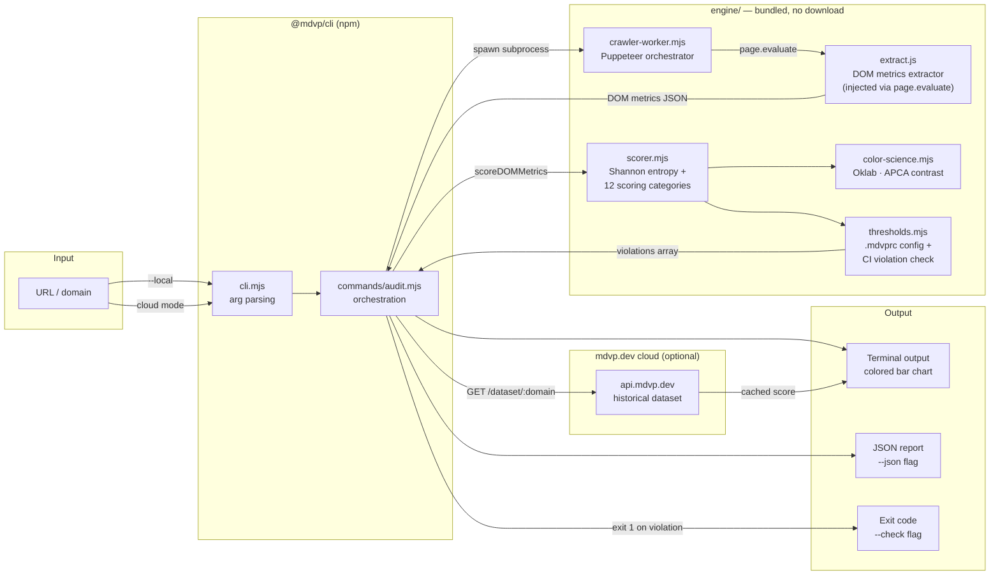
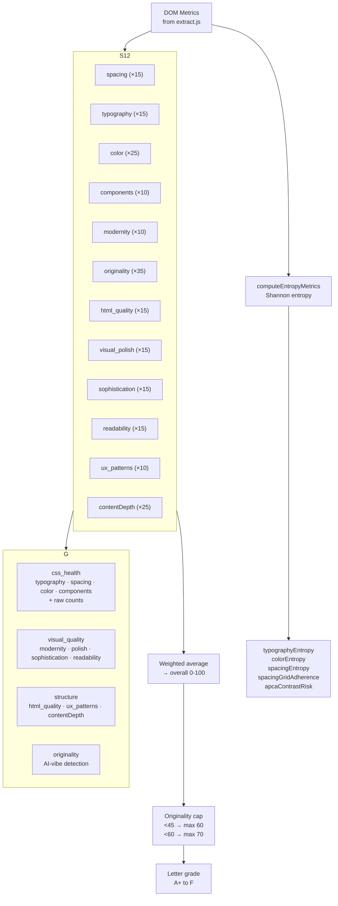
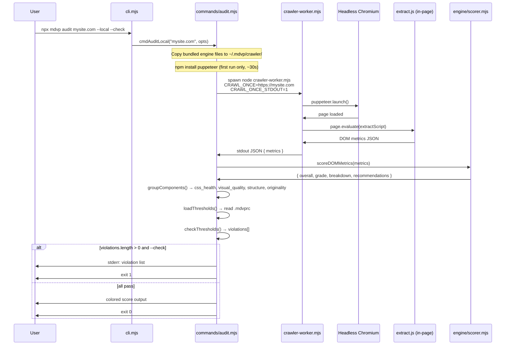
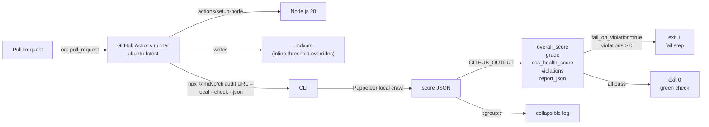

# Architecture

MDVP is a design quality measurement tool for any live URL. It works in two modes:

- **Local mode** (`--local`): fully offline after first Puppeteer install. No API key, no cloud call. Suitable for CI.
- **Cloud mode** (default): reads historical scores from `api.mdvp.dev`. Fast, no browser needed.

---

## System overview



---

## Scoring pipeline



---

## Local mode: offline crawl



---

## GitHub Action integration



---

## File map

```
@mdvp/cli/
├── cli.mjs                   Entry point — arg parsing, command routing
├── commands/
│   ├── audit.mjs             Local + cloud audit orchestration
│   ├── auth.mjs              npx mdvp login (stores key in ~/.mdvp/config.json)
│   ├── compare.mjs           Side-by-side two-site comparison
│   └── hire.mjs              Submit/recrawl (cloud)
├── engine/                   Bundled scoring engine — shipped in npm tarball
│   ├── color-science.mjs     Oklab conversion, APCA contrast, palette analysis
│   ├── scorer.mjs            12-category scoring algorithm + groupComponents
│   ├── thresholds.mjs        .mdvprc loader + CI violation checker
│   ├── crawler-worker.mjs    Puppeteer orchestrator (local mode)
│   └── extract.js            DOM metrics extractor (injected into page)
├── lib/
│   ├── config.mjs            ~/.mdvp/config.json read/write
│   ├── constants.mjs         Version, help text, category labels
│   ├── format.mjs            Terminal color, bar chart, text formatter
│   └── http.mjs              Minimal HTTPS client (no fetch dependency)
├── mcp.mjs                   MCP server (npx mdvp mcp)
├── action/                   GitHub Action — NOT in npm tarball
│   ├── action.yml            Composite action definition
│   └── README.md             Action usage docs
└── test/                     Unit tests — NOT in npm tarball
    ├── fixtures/metrics.mjs  DOM metrics fixtures (minimal/good/vibecoded)
    ├── color-science.test.mjs
    ├── thresholds.test.mjs
    └── scorer.test.mjs
```

---

## Key design decisions

**Why Shannon entropy for design consistency?**  
Entropy (H) quantifies variety in a distribution. `H=0` means perfect consistency (one value, used everywhere); `H=1` means maximum chaos (all values equally frequent). Applied to font sizes, spacing values, and color counts, it gives an objective measure of design system discipline that doesn't require a reference design.

**Why Oklab for color analysis?**  
RGB distance is perceptually non-uniform — two colors that are "close" in RGB can look very different to human eyes. Oklab is designed so that Euclidean distance in the space correlates with perceived color difference, making `deltaE` meaningful for detecting near-duplicate colors and palette analysis.

**Why APCA contrast instead of WCAG 2.1?**  
WCAG 2.1 uses a simple luminance ratio that produces many false positives (e.g., large bold text flagged when it reads fine) and false negatives (some small gray text passes that shouldn't). APCA models spatial frequency, font weight, and text size — it better predicts what's actually readable.

**Why bundle the scoring engine in the npm package?**  
Requiring a cloud download on first run breaks CI: no network egress policy, no reliable cache, version pinning is impossible. Bundling `scorer.mjs` + `color-science.mjs` in the tarball makes `--local` fully reproducible — same algorithm version as the CLI version.

**Why a composite GitHub Action (not JS/Docker)?**  
Composite actions have no container startup cost, use the runner's existing Node.js install, and are easier to audit — the full logic is plain shell + `node` inline scripts. Docker actions add ~30s cold start; JS actions require compiled bundles checked into the repo.
