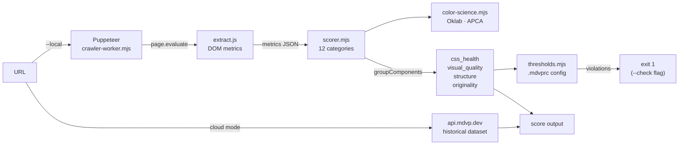

# @mdvp/cli

MDVP (Machine Design Vision Protocol) is a structured protocol for visual understanding of web interfaces, built for AI agents rather than humans. Give it a URL, get back a compact protocol block an agent can reason over directly. It works through two channels simultaneously: a DOM channel that extracts exact computed CSS values, layout structure, and semantic signals via an `elementFromPoint` matrix (12x8 grid), ancestor chain traversal, and CDP CSS extraction; and a pixel channel that captures rendered screenshots and region fragments for ANSI ASCII color verification. Output is plain text in MDVP-T/1.0 format.

- Docs: https://mdvp.dev/docs
- Protocol spec: https://mdvp.dev/spec.md
- Web: https://mdvp.dev
- Open-source readiness: [docs/OPEN_SOURCE_READINESS.md](docs/OPEN_SOURCE_READINESS.md)
- Architecture: [ARCHITECTURE.md](ARCHITECTURE.md)

## How it works



See [ARCHITECTURE.md](ARCHITECTURE.md) for sequence diagrams, scoring pipeline detail, and design decisions.

## Open Source Status

This repository is the intended public, open-source entry point for MDVP. It contains the CLI and MCP server that let agents audit, perceive, compare, and submit web interfaces through the MDVP API. The hosted API, crawler infrastructure, payment system, private datasets, and production deployment configuration are separate services and are not part of this package.

The package is MIT licensed and accepts focused contributions that improve CLI reliability, MCP interoperability, protocol examples, documentation, and safe local crawler workflows.

---

## Install

```bash
npm install -g @mdvp/cli
```

Or run without installing:

```bash
npx @mdvp/cli <command>
```

---

## Quickstart

```bash
# Score a site from the dataset (instant)
npx @mdvp/cli audit stripe.com

# Full MDVP-T/1.0 analysis with live crawl
npx @mdvp/cli perceive stripe.com --live

# Compare two sites
npx @mdvp/cli compare figma.com linear.app
```

---

## Commands

### `audit <domain>`

Fetch a design quality score from the MDVP dataset.

```bash
npx @mdvp/cli audit stripe.com
```

```
stripe.com    B-    60/100

  visual-hierarchy     72
  color-consistency    68
  spacing-rhythm       55
  typography           61
  motion-quality       44
```

Add `--live` to crawl the page fresh instead of using cached data.

---

### `perceive <domain>`

Run a full MDVP-T/1.0 analysis. Returns the complete protocol block with all named sections.

```bash
npx @mdvp/cli perceive stripe.com --live
```

```
[DOM]
font-stack: Inter, system-ui
bg: #0a2540  fg: #ffffff
layout: flex/column  gap: 0px
above-fold-text-density: 0.18

[CLASSIFY]
style: corporate-saas
palette: dark-navy + electric-blue accent
motion: subtle / entrance-only

[DIAGNOSIS]
- Spacing rhythm breaks at 768px breakpoint
- CTA contrast ratio 3.8:1 (below WCAG AA for large text)
- Hero font-size 64px collapses to 32px with no intermediate step
```

---

### `compare <domain-a> <domain-b>`

Side-by-side score comparison.

```bash
npx @mdvp/cli compare figma.com linear.app
```

```
                figma.com    linear.app
overall            B+ 74       A- 82
visual-hierarchy     78          85
color-consistency    71          88
spacing-rhythm       69          79
typography           80          83
motion-quality       72          76
```

---

### `top`

List top-scored sites in the dataset.

```bash
npx @mdvp/cli top
npx @mdvp/cli worst
npx @mdvp/cli label premium
```

```
1.  linear.app        A    92/100
2.  vercel.com        A-   88/100
3.  raycast.com       A-   86/100
4.  clerk.com         B+   81/100
5.  resend.com        B+   79/100
```

Labels: `premium`, `good`, `vibecoded`, `bad`

---

### `label <label>`

List scored sites with a dataset label.

```bash
npx @mdvp/cli label premium
npx @mdvp/cli label good
npx @mdvp/cli label vibecoded
npx @mdvp/cli label bad
```

Labels: `premium`, `good`, `vibecoded`, `bad`

---

### `submit <domain>`

Submit a URL for crawl. Results are available in roughly 60 seconds.

```bash
npx @mdvp/cli submit myapp.com
npx @mdvp/cli submit myapp.com --local
```

Remote submit requires an API key. Run `npx @mdvp/cli login` first. Use `--local` to crawl on this machine instead of using remote credits.

---

### `hire`

Become a crawler node. Your machine runs headless Puppeteer, crawls assigned URLs, and posts results back to the MDVP API. You earn credits per successful crawl.

```bash
npx @mdvp/cli hire --daemon --tabs=4
```

```
[hire] starting crawler node  tabs=4
[hire] waiting for work...
[hire] crawling: notion.so
[hire] crawling: craft.do
[hire] posted 2 results  +0.40 credits
```

Flags:
- `--daemon` — run continuously in the background
- `--tabs=N` — number of parallel Puppeteer tabs (default: 2)
- `--recrawl <domain>` — force a recrawl of a specific domain

---

### `mcp`

Start an MCP (Model Context Protocol) stdio server. Exposes MDVP tools to any MCP-compatible agent or IDE.

```bash
npx @mdvp/cli mcp
```

#### Claude Desktop config

```json
{
  "mcpServers": {
    "mdvp": {
      "command": "npx",
      "args": ["@mdvp/cli", "mcp"]
    }
  }
}
```

Available MCP tools: `audit_url`, `perceive_url`, `compare_sites`, `top_sites`, `submit_for_crawl`

---

### `login`

Authenticate and store your API key locally at `~/.mdvp/config.json`.

```bash
npx @mdvp/cli login
```

---

## Protocol: MDVP-T/1.0

MDVP-T/1.0 is a plain-text format with named sections. Each section is a compact key-value or prose block. The full spec is at https://mdvp.dev/spec.md.

Sections:

| Section | Contents |
|---|---|
| `[DOM]` | Computed CSS, layout structure, font stack, color values |
| `[ENTROPY]` | Visual complexity score, element density |
| `[SALIENCY]` | Attention map derived from element weights |
| `[TEMPORAL]` | Load timing, paint events |
| `[MOTION-TAXONOMY]` | Animation types, duration, easing |
| `[INTERACTION]` | Hover states, focus rings, cursor changes |
| `[CLASSIFY]` | Style label, palette description, motion category |
| `[TOKENS]` | Design token candidates extracted from computed values |
| `[DIAGNOSIS]` | Specific issues found |
| `[RECOMMENDATIONS]` | Actionable fixes |
| `[VISION]` | GPT-4 vision analysis of the rendered screenshot |

Example block:

```
[CLASSIFY]
style: minimal-saas
palette: off-white + dark-charcoal, no accent
motion: none

[TOKENS]
--color-bg: #f9f9f7
--color-fg: #1a1a1a
--font-size-base: 16px
--font-size-hero: 56px
--spacing-section: 96px

[DIAGNOSIS]
- No visible focus indicators on nav links
- Line-height 1.3 on body copy (recommend 1.5-1.6)
- Mobile hero font-size 56px unchanged from desktop

[RECOMMENDATIONS]
- Add :focus-visible outline to all interactive elements
- Increase body line-height to 1.55
- Add fluid clamp() on hero font-size for mobile
```

---

## File Structure

```
cli.mjs              # entry point + command dispatch
commands/
  audit.mjs          # audit, local crawl
  perceive.mjs       # perceive command
  compare.mjs        # compare, top, worst
  hire.mjs           # hire, recrawl, submit
  auth.mjs           # login, balance
lib/
  http.mjs           # API client
  config.mjs         # ~/.mdvp/config.json
  constants.mjs      # CATS, VERSION, HELP
  format.mjs         # ANSI, display utils
mcp.mjs              # MCP server (stdio)
```

## Requirements

- Node.js 18+
- Puppeteer (installed automatically, used for `--live` and `hire`)

## Contributing

Read [CONTRIBUTING.md](CONTRIBUTING.md) before opening a pull request. Security reports should follow [SECURITY.md](SECURITY.md), and roadmap context lives in [ROADMAP.md](ROADMAP.md).

---

Built by [Tixo Digital](https://mdvp.dev)
