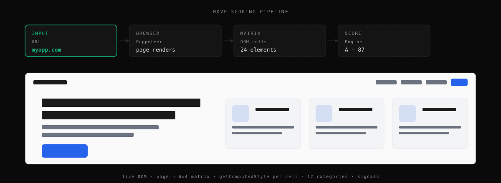

```
  ███╗   ███╗██████╗ ██╗   ██╗██████╗
  ████╗ ████║██╔══██╗██║   ██║██╔══██╗
  ██╔████╔██║██║  ██║██║   ██║██████╔╝
  ██║╚██╔╝██║██║  ██║╚██╗ ██╔╝██╔═══╝
  ██║ ╚═╝ ██║██████╔╝ ╚████╔╝ ██║
  ╚═╝     ╚═╝╚═════╝   ╚═══╝  ╚═╝
```

# @mdvp/cli

[](https://github.com/Tixo-Digital/mdvp-cli/actions/workflows/ci.yml)
[](https://www.npmjs.com/package/@mdvp/cli)
[](https://www.npmjs.com/package/@mdvp/cli)
[](https://mdvp.dev)
[](LICENSE)

**Design quality measurement for any live URL.** Runs locally via Puppeteer — no API key, no account, no baseline needed.

```bash
npx @mdvp/cli audit myapp.com --local
```

---

## Why

Tools like v0, Bolt, Lovable, and Cursor generate frontends fast — but the output has a fingerprint: Inter as the primary font, Tailwind's default purple-blue-pink gradient palette, every button is `border-radius: 9999px`, 40+ unique CSS colors with no system. Visual regression tools can't help (no prior snapshot to compare against); linters check syntax, not rendered quality.

MDVP measures what matters. It instruments the live DOM, extracts computed CSS values via `getComputedStyle()`, runs perceptual color analysis in Oklab space, and scores against design-system heuristics. Fully deterministic: same DOM → same score, bit-identical.

## Quickstart

```bash
# Score any URL locally (first run downloads Puppeteer's Chromium, ~30s)
npx @mdvp/cli audit myapp.com --local

# Enforce thresholds in CI — exits 1 on violation
npx @mdvp/cli audit myapp.com --local --check

# JSON output for scripting
npx @mdvp/cli audit myapp.com --local --json | jq .components.css_health
```

**Output:**

```
myapp.com  C+  58/100  local crawl

  css_health      ████████░░░░  48   32 colors · 4 fonts · 61% on grid
  visual_quality  ██████████░░  67
  structure       ████████████  81
  originality     ████░░░░░░░░  38

entropy 0.82 · apca 94.2 · grid 61%
Lowest: originality (38) · color (44) · spacing (51)
  · 32 unique colors. Professional limit: 8–12
  · 4 font families. Professional limit: 2
  · Inter + Tailwind purple-blue palette — AI-generated design fingerprint
```

## How it works



Puppeteer opens the URL, `getComputedStyle()` is read on every element, the scorer groups 12 categories into four named components, and a signal registry of independent AI-pattern detectors penalises the `originality` component. See [the methodology paper](docs/methodology.md) for the full algorithm, weight table, and prior-work comparison.

## Documentation

- [Install](docs/install.md) — requirements, install, first run, troubleshooting
- [CLI commands](docs/cli.md) — every flag, every subcommand, exit codes
- [Scoring](docs/scoring.md) — what the four components measure, the signal registry
- [DESIGN.md compliance](docs/design-md.md) — diff your rendered DOM against your design system
- [CI enforcement](docs/ci.md) — `.mdvprc`, GitHub Action, exit codes, other CI systems
- [MCP server](docs/mcp-server.md) — plug into Claude, OpenCode, Cursor, Windsurf, Cline
- [Architecture](docs/architecture.md) — components, job protocol, self-hosting
- [Methodology](docs/methodology.md) — full scoring paper (4 pillars, weight table)
- [Benchmark](docs/benchmark.md) — sensitivity / ablation + live reference panel
- [Development](docs/development.md) — setup, tests, adding a signal, cutting a release

## Add a badge to your README

Once a site is in the dataset (`npx @mdvp/cli submit yoursite.com`), show its score:

```markdown
[](https://mdvp.dev)
```

The endpoint returns a [shields.io endpoint](https://shields.io/badges/endpoint-badge) payload — label `design`, message `A 87`, colored by grade. It reflects the latest score for that domain.

## Contributing

Bug reports and feature requests: [GitHub Issues](https://github.com/Tixo-Digital/mdvp-cli/issues). Code and signal detectors: see [CONTRIBUTING.md](CONTRIBUTING.md). Adding a signal is a one-file change — see [the development guide](docs/development.md#adding-a-signal).

## Citing

If you use MDVP in research, cite via the "Cite this repository" button (powered by [`CITATION.cff`](CITATION.cff)). A preprint draft of the methodology is in [`docs/paper.md`](docs/paper.md).

## License

MIT. The local scoring engine, CLI, MCP server, and GitHub Action are in this repository. The hosted coordination layer and dataset are not part of this open-source package — see [docs/architecture.md](docs/architecture.md#what-is-not-open-source) for the boundary.
