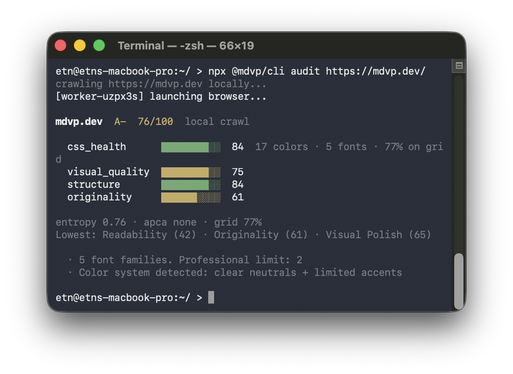

# @mdvp/cli

**Design linter for AI-generated frontends.** Audit any live URL for HTML/CSS quality, design-system drift, accessibility-relevant structure, and common AI UI patterns. Default audits run locally through the exact rendered browser path with no API key, no account, and no screenshot baseline; static/cache shortcuts require `MDVP_USE_CACHE=1`.

[](https://github.com/Tixo-Digital/mdvp-cli/actions/workflows/ci.yml)
[](https://www.npmjs.com/package/@mdvp/cli)
[](https://www.npmjs.com/package/@mdvp/cli)
[](LICENSE)

```bash
npx @mdvp/cli audit myapp.com
```



MDVP gives teams and agents a deterministic design-quality signal before a page has users, screenshots, or a baseline. It reads the rendered DOM with `getComputedStyle()`, measures color/spacing/type discipline, checks APCA contrast and semantic structure, and flags common generated-UI patterns such as default Tailwind palettes, pill-radius everything, generic hero chips, and missing design tokens.

Use it to:

- Catch vibe-coded UI drift before merge.
- Gate preview URLs in CI with `audit --check`.
- Give Cursor, Claude, OpenCode, Windsurf, and Cline an MCP design-quality tool.
- Publish a score badge after submitting a public result.

### Pipeline


Exact audit launches the local browser crawler → extracts rendered DOM metrics with `getComputedStyle()` → 12 categories score into 4 components → a pattern registry highlights common design heuristics. Set `MDVP_USE_CACHE=1` only when you intentionally want the approximate static/cache shortcut; add `--fast` in scripts to make that opt-in visible. See [How it works](#how-it-works) below for the full walkthrough.

---

## Development Proof

MDVP is useful when it gives a developer a concrete next change, not just a score.

- **Dogfood finding:** `node cli.mjs audit mdvp.dev` produced B+ 75/100 and flagged an actionable issue: 5 font families on the rendered page where the professional limit is 2. The next engineering task is clear: consolidate the site typography stack and re-run the audit.
- **Before/after workflow:** the reproducible design-system fixture starts at 95/A+; stacking generated-UI problems drops it to 60/B- with originality at 0. That maps directly to development actions: reduce font families, replace default Tailwind purple-blue gradients, normalize pill radii, add semantic design tokens, and add real content.
- **PR gate:** `npx @mdvp/cli init --github-action` turns those same checks into a preview-URL CI gate, so color sprawl, font drift, low spacing-grid adherence, and banned generated-UI signals fail before merge.

See [Development proof](docs/development-proof.md) for the concrete workflow and [Benchmark](docs/benchmark.md) for the validation caveats.

---

## Why

Tools like v0, Bolt, Lovable, and Cursor generate frontends fast — but the output often shares common patterns: Inter as the primary font, Tailwind's default purple-blue-pink gradient palette, every button is `border-radius: 9999px`, 40+ unique CSS colors with no system. Visual regression tools can't help when there is no prior screenshot to compare against; code linters check syntax, not rendered quality.

MDVP gives you numbers on the page structure and design system. The default audit instruments the rendered page, extracts computed CSS values via `getComputedStyle()`, and is the right mode for disputed results or screenshot-backed evidence. The static analyzer is still available as an approximate shortcut, but only when you explicitly opt in with `MDVP_USE_CACHE=1 --fast`.

## Quickstart

```bash
# Score any URL locally with rendered browser evidence
npx @mdvp/cli audit myapp.com

# Check local first-run prerequisites without crawling
npx @mdvp/cli doctor

# Make the default rendered browser path explicit in scripts
npx @mdvp/cli audit myapp.com --exact

# Use the approximate static/cache shortcut only after opting in
MDVP_USE_CACHE=1 npx @mdvp/cli audit myapp.com --fast

# Enforce thresholds in CI — exits 1 on violation
npx @mdvp/cli audit myapp.com --check

# Score a logged-in local or staging page through your own Chrome session
MDVP_BROWSER_URL=http://127.0.0.1:9222 npx @mdvp/cli audit http://localhost:3000/dashboard --json

# Create starter .mdvprc and GitHub Actions workflow
npx @mdvp/cli init --github-action

# Look up a known site from the public dataset (no local crawl)
npx @mdvp/cli audit myapp.com --cloud

# Contribute your local result to the public dataset
npx @mdvp/cli audit myapp.com --swarm

# JSON output for scripting
npx @mdvp/cli audit myapp.com --json | jq .components.css_health

# Compare two saved JSON snapshots
npx @mdvp/cli diff before.json after.json

# Print a README badge for your site
npx @mdvp/cli badge myapp.com
```

**Output:**

```
myapp.com  C+  58/100  local audit

  css_health      ████████░░░░  48   32 colors · 4 fonts · 61% on grid
  visual_quality  ██████████░░  67
  structure       ████████████  81
  originality     ████░░░░░░░░  38

entropy 0.82 · apca 94.2 · grid 61%
Lowest: originality (38) · color (44) · spacing (51)
  · 32 unique colors. Professional limit: 8–12
  · 4 font families. Professional limit: 2
  · Inter + Tailwind purple-blue palette — common design pattern
```

## How it works

Default audit uses Puppeteer for rendered DOM and computed style evidence, groups 12 categories into four named components, and uses independent heuristic detectors to score common AI-generated UI patterns. The static Rust analyzer remains available through `MDVP_USE_CACHE=1 --fast` for low-resource loops, and its JSON output is marked `source: "static"` with limitations. See [the methodology paper](docs/methodology.md) for the full algorithm, weight table, and prior-work comparison.

## Documentation

- [Install](docs/install.md) — requirements, install, first run, troubleshooting
- [CLI commands](docs/cli.md) — every flag, every subcommand, exit codes
- [Scoring](docs/scoring.md) — what the four components measure, the signal registry
- [DESIGN.md compliance](docs/design-md.md) — diff audited page metrics against your design system
- [Authenticated page scoring](docs/authenticated-scoring.md) — local Chrome session connector prototype and privacy model
- [CI enforcement](docs/ci.md) — `.mdvprc`, GitHub Action, exit codes, other CI systems
- [Containers](docs/container.md) — Alpine, distroless, Apple Container, and exact/browser image guidance
- [Standalone binaries](docs/binaries.md) — release artifact decision and static-only binary constraints
- [Nix](docs/nix.md) — `nix develop`, reproducible verify/smoke apps, and NixOS notes
- [MCP server](docs/mcp-server.md) — plug into Claude, OpenCode, Cursor, Windsurf, Cline
- [Architecture](docs/architecture.md) — components, job protocol, self-hosting
- [Methodology](docs/methodology.md) — full scoring paper (4 pillars, weight table)
- [Benchmark](docs/benchmark.md) — sensitivity / ablation + live reference panel
- [Adoption playbook](docs/adoption.md) — examples, positioning, and honest distribution loops
- [Development](docs/development.md) — setup, tests, adding a signal, cutting a release

## Add a score badge to your project

Show your MDVP score in your project's README: [docs/badge.md](docs/badge.md). Submit your site, then generate the shields.io markdown:

```bash
npx @mdvp/cli badge myapp.com
```

## Contributing

Bug reports and feature requests: [GitHub Issues](https://github.com/Tixo-Digital/mdvp-cli/issues). Code and signal detectors: see [CONTRIBUTING.md](CONTRIBUTING.md). Adding a signal is a one-file change — see [the development guide](docs/development.md#adding-a-signal).

## Citing

If you use MDVP in research, cite via the "Cite this repository" button (powered by [`CITATION.cff`](CITATION.cff)). A preprint draft of the methodology is in [`docs/paper.md`](docs/paper.md).

## License

MIT. The local scoring engine, CLI, MCP server, and GitHub Action are in this repository. The hosted coordination layer and dataset are not part of this open-source package — see [docs/architecture.md](docs/architecture.md#what-is-not-open-source) for the boundary.
