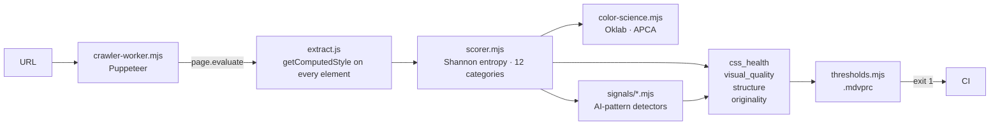
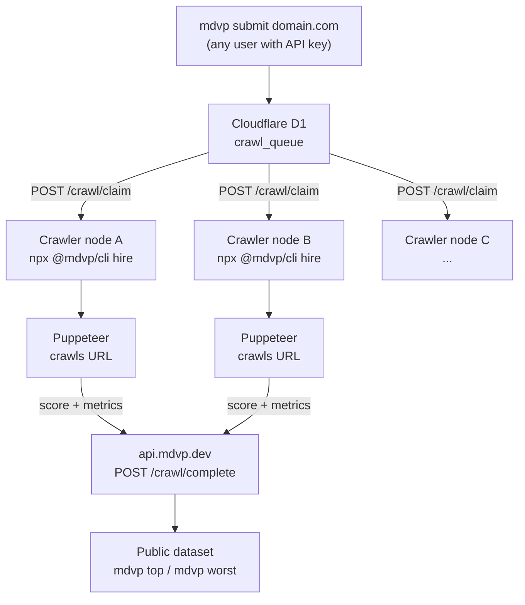

```
  ███╗   ███╗██████╗ ██╗   ██╗██████╗
  ████╗ ████║██╔══██╗██║   ██║██╔══██╗
  ██╔████╔██║██║  ██║██║   ██║██████╔╝
  ██║╚██╔╝██║██║  ██║╚██╗ ██╔╝██╔═══╝
  ██║ ╚═╝ ██║██████╔╝ ╚████╔╝ ██║
  ╚═╝     ╚═╝╚═════╝   ╚═══╝  ╚═╝
```

# @mdvp/cli

[](https://github.com/Tixo-Digital/mdvp-cli/actions/workflows/ci.yml)
[](https://www.npmjs.com/package/@mdvp/cli)
[](LICENSE)

**Design quality measurement for any live URL.** Runs locally via Puppeteer — no API key, no account, no baseline needed.

```bash
npx @mdvp/cli audit myapp.com --local
```

---

## The problem with AI-generated UIs

Tools like v0, Bolt, Lovable, and Cursor generate frontends fast. But the output has a fingerprint:

- Inter or Poppins as the primary font
- Tailwind's default purple-blue-pink gradient palette  
- Every button is `border-radius: 9999px`
- 40+ unique CSS colors with no system
- Spacing values that ignore the 4px grid

Visual regression tools can't help — there's no prior snapshot to compare against. Linters check syntax, not rendered quality.

MDVP measures what matters. It instruments the live DOM, extracts computed CSS values, runs perceptual color analysis in Oklab space, and scores against design system heuristics. Fully deterministic: same snapshot → same score, bit-identical.

---

## Quickstart

```bash
# Audit any URL locally (first run installs Puppeteer ~30s)
npx @mdvp/cli audit myapp.com --local

# Enforce thresholds in CI — exits 1 on violation
npx @mdvp/cli audit myapp.com --local --check

# JSON output for scripting
npx @mdvp/cli audit myapp.com --local --json | jq .components.css_health
```

**Output:**

```
myapp.com  C+  58/100  local crawl

  css_health      ████████░░░░  48   32 colors · 4 fonts · 61% on grid
  visual_quality  ██████████░░  67
  structure       ████████████  81
  originality     ████░░░░░░░░  38

entropy 0.82 · apca 94.2 · grid 61%
Lowest: originality (38) · color (44) · spacing (51)
  · 32 unique colors. Professional limit: 8–12
  · 4 font families. Professional limit: 2
  · Inter + Tailwind purple-blue palette — AI-generated design fingerprint
```

---

## CI enforcement

### `.mdvprc`

```json
{
  "thresholds": {
    "max_colors": 20,
    "max_font_families": 2,
    "max_font_sizes": 6,
    "min_spacing_grid_pct": 70,
    "min_css_health": 65
  }
}
```

```bash
npx @mdvp/cli audit myapp.com --local --check
# exits 0 on pass, exits 1 with violation list on fail
```

### GitHub Action

```yaml
name: Design quality

on: [pull_request]

jobs:
  design:
    runs-on: ubuntu-latest
    steps:
      - uses: actions/checkout@v4
      - uses: Tixo-Digital/mdvp-cli/action@main
        with:
          url: ${{ env.PREVIEW_URL }}
          max_colors: 20
          max_font_families: 2
          min_css_health: 65
          fail_on_violation: 'true'
```

The action runs Puppeteer locally on the runner. No screenshot or DOM data sent anywhere. Full docs: [action/README.md](action/README.md)

---

## What it measures

### `css_health` — objective CSS metrics

Computed directly from `getComputedStyle()` on every rendered element. No model, no heuristic — these are facts about what's in the DOM.

| Metric | Default limit | Signal |
|---|---|---|
| Unique colors | ≤ 30 | Color system discipline |
| Font families | ≤ 3 | Typography coherence |
| Font sizes | ≤ 8 | Type scale |
| Border-radius values | ≤ 6 | Component consistency |
| Spacing on 4px grid | ≥ 60% | Layout rhythm |
| CSS custom properties | — | Design token adoption |

### `visual_quality` — perceptual analysis

- **Shannon entropy** on font sizes and spacing. `H=0` = one value everywhere (system). `H=1` = all values equally frequent (chaos). Values are clustered within ±2px tolerance before computing entropy.
- **Oklab color distance** for near-duplicate detection. RGB distance is perceptually non-uniform; Oklab Euclidean distance (ΔE) correlates with what eyes actually distinguish. Threshold: ΔE < 0.08.
- **APCA contrast** (Advanced Perceptual Contrast Algorithm) — more accurate than WCAG 2.1 luminance ratio, accounts for font size and weight.

### `structure` — semantic quality

HTML landmark usage, heading hierarchy, accessible alt text, content depth, UX patterns.

### `originality` — AI-generated UI detection

A directory of independent detectors — [`engine/signals/`](engine/signals/), one file per anti-pattern. The score starts at 100 and each matched signal subtracts a penalty:

| Signal | Why it matters |
|---|---|
| `inter-font` | Inter / Poppins / Nunito / Outfit — default in v0, Lovable, Bolt |
| `tailwind-palette` | Default Tailwind purple-pink-blue accents |
| `pill-radius` | `border-radius: 9999px` everywhere (Shadcn/Tailwind default) |
| `pulse-animation` | Gratuitous `animate-pulse` dots and badges |
| `eyebrow-chip` | Small badge above the H1 — generated-hero cliché |
| `status-dot` | Decorative green "online" dots implying fake live state |
| `gradient-text` | Gradient-filled headlines (`background-clip: text`) |
| `sparse-content` | Placeholder page, very few elements |
| `no-design-tokens` | Fewer than ~5 CSS custom properties |
| `emoji-icons` | Emoji standing in for an icon set |

A high originality penalty caps the overall score regardless of other categories. Signals are **configurable per project** via `.mdvprc` — disable one you intentionally break, or harden one you want banned:

```json
{
  "signals": {
    "disabled": ["system-font-only"],
    "penalties": { "pill-radius": 25 }
  }
}
```

A human-designed site with Inter and a tight system shouldn't be penalised heavily — the `isUtilitySite()` heuristic relaxes rules for tools and dashboards. **Adding a signal is a one-file change** — see [`engine/signals/README.md`](engine/signals/README.md).

---

## DESIGN.md compliance

Signals catch *generic* anti-patterns. A [`DESIGN.md`](https://github.com/google-labs-code/design.md) file lets you check the opposite: does the live DOM actually follow **your** design system?

Drop a `DESIGN.md` in your repo (the Google design.md format — YAML front matter with `colors`, `typography`, `rounded`, `spacing` tokens). MDVP picks it up automatically and diffs the rendered page against it:

```bash
npx @mdvp/cli audit myapp.com --local
# … normal scores …
#
# DESIGN.md (Acme)  3 errors · 2 warnings  −18 from 74
#   ✗ Off-palette color rgb(236, 72, 153) (ΔE 0.14 from nearest token)
#   ✗ Font "Inter" is not in the DESIGN.md typography scale
#   · Border-radius 9999px is off the DESIGN.md rounded scale
```

- **Colors** are matched perceptually in Oklab space (ΔE), not by string equality — `#2563eb` and `rgb(38,100,236)` are the same token.
- **Two modes.** Without `--check`, spec mismatches apply a soft penalty (capped at −40) to the score. With `--check`, off-palette colors and off-scale fonts become hard violations that exit 1 — so an agent that ignored your `DESIGN.md` fails CI.
- Point at a non-default path with `--design=path/to/DESIGN.md`.

```bash
npx @mdvp/cli audit myapp.com --local --check   # DESIGN.md errors fail the build
```

---

## Badge

Once a site is in the dataset (`npx @mdvp/cli submit yoursite.com`), show its score in your README:

```markdown
[](https://mdvp.dev)
```

The endpoint returns a [shields.io endpoint](https://shields.io/badges/endpoint-badge) payload — label `design`, message `A 87`, colored by grade. It reflects the latest score for that domain.

---

## JSON schema

```json
{
  "url": "https://myapp.com",
  "overall_score": 58,
  "grade": "C+",
  "components": {
    "css_health": {
      "score": 48,
      "unique_colors": 32,
      "unique_font_families": 4,
      "unique_font_sizes": 11,
      "unique_border_radii": 3,
      "spacing_on_grid_pct": 61,
      "custom_properties": 4,
      "has_dark_mode": false
    },
    "visual_quality": { "score": 67 },
    "structure":      { "score": 81 },
    "originality":    { "score": 38 }
  },
  "entropy": {
    "overall": 0.82,
    "typography": 0.71,
    "color": 0.87,
    "spacing": 0.91,
    "spacing_grid_pct": 61,
    "apca_risk": "none"
  },
  "violations": [
    { "field": "unique_colors", "value": 32, "limit": 20, "msg": "32 unique colors (limit: 20)" }
  ],
  "recommendations": [
    "32 unique colors. Professional limit: 8–12",
    "4 font families. Professional limit: 2",
    "Inter + Tailwind blue palette — AI-generated design pattern"
  ]
}
```

---

## All commands

| Command | Mode | Description |
|---|---|---|
| `audit <url> --local` | offline | Score any live URL, fully local |
| `audit <url> --local --check` | offline | Enforce `.mdvprc` thresholds + DESIGN.md, exit 1 on violation |
| `audit <url> --local --design=DESIGN.md` | offline | Diff DOM against a specific DESIGN.md spec |
| `audit <url> --local --json` | offline | JSON output |
| `audit <domain>` | cloud | Instant score from dataset (no Puppeteer) |
| `compare <a> <b>` | cloud | Side-by-side comparison |
| `top [n]` / `worst [n]` | cloud | Dataset leaderboard |
| `perceive <domain> --live` | cloud | Full MDVP-T/1.0 analysis for AI agents |
| `mcp` | local | Run as MCP server |
| `login` | — | Store API key for cloud commands |

### MCP server (Claude, Cursor, etc.)

```bash
npx @mdvp/cli mcp
```

```json
{
  "mcpServers": {
    "mdvp": {
      "command": "npx",
      "args": ["-y", "@mdvp/cli@latest", "mcp"]
    }
  }
}
```

---

## Architecture

### Local scoring engine



Engine is bundled in the npm package (`engine/`). No cloud download. See [docs/methodology.md](docs/methodology.md) for algorithm details.

### Distributed crawling network

MDVP maintains a public dataset of scored sites. The dataset grows through a distributed network of contributor-run crawler nodes.



Each node polls `api.mdvp.dev/crawl/claim`, crawls the assigned URL with Puppeteer, and reports the result back. The worker source code is in [`engine/crawler-worker.mjs`](engine/crawler-worker.mjs) — the same file that runs when you do `npx @mdvp/cli hire`.

```bash
# Become a crawler node — contributes crawl capacity to the public dataset
npx @mdvp/cli hire

# Run as background daemon
npx @mdvp/cli hire --daemon

# More parallel tabs = more throughput
npx @mdvp/cli hire --tabs=4
```

No API key required to run a node. Nodes are anonymous by default (`NODE_ID` defaults to a random handle).

Full system architecture, API protocol, and self-hosting notes: [docs/architecture.md](docs/architecture.md)

---

## Development

```bash
git clone https://github.com/Tixo-Digital/mdvp-cli
cd mdvp-cli
npm ci
npm test          # 75 tests, node:test built-in, zero devDeps
```

See [CONTRIBUTING.md](CONTRIBUTING.md).

---

## Citing

If you use MDVP in research, cite it via the "Cite this repository" button (powered by [`CITATION.cff`](CITATION.cff)). A preprint draft of the methodology is in [`docs/paper.md`](docs/paper.md).

---

## License

MIT. Cloud API, Workers infrastructure, billing, and private datasets are separate and not in this repository.
